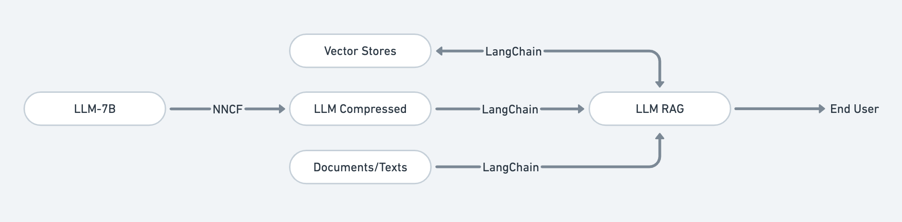
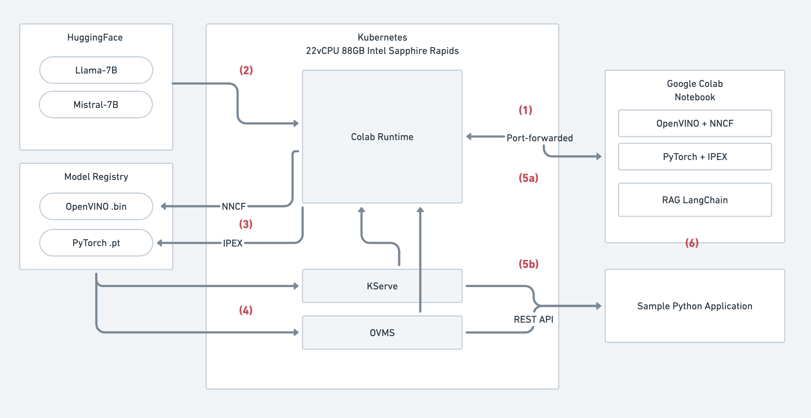

# LLM CPU

This is an example of how to serve a simple optimized context aware LLM on CPU.

## Model Flow



An open-source LLM 7B model (Llama2, Mistral or Gemma) compressed and served with RAG for building an optimized context aware LLM on CPU. NNCF/IPEX used for compressing LLM into optimized model to inference on top of Intel CPU. Vector Stores used to storing and retrieving text data in a way that is efficient for augmenting LLM with RAG output. RAG with LangChain used for generating text that is relevant to a specific topic as LLM is provided with context for a question.

## System Flow



The above system diagram to use pre-trained large language models (LLMs) from Hugging Face in Google Colab Notebook or a sample Python application. The system uses Kubernetes and port forwarding to make the LLM models accessible to the notebook or application.

Here's a breakdown of the steps involved:
1. Interfacing Google Colab Notebook through port-forwarded local runtime that placed on Kubernetes: A local runtime environment is set up on Kubernetes and its port is forwarded to make it accessible to the Google Colab Notebook. This allows the notebook to interact with the LLM models running on Kubernetes.
2. Pulling pre-trained LLM models from Hugging Face models repositories: The system pulls pre-trained LLM models from the Hugging Face model repository. These models are typically very large and computationally expensive to run.
3. Compressing or quantize LLM models to smaller and optimized models with NNCF/IPEX to model registry: The system uses tools like NNCF and IPEX to compress or quantize the LLM models. This makes the models smaller and faster to run, which is important for deploying them in a production environment. The compressed models are then stored in a model registry.
4. Model server KServe/OVMS referenced to model registry to serve compressed models: A model server like KServe or OVMS is used to load the compressed models from the model registry and serve them to the Google Colab Notebook or sample Python application.
5. Serving models API to Google Colab Notebook (a) or Sample Python Application (b): The model server provides an API that the Google Colab Notebook or  sample Python application can use to interact with the LLM models. The notebook or application can send text prompts to the API, and the API will return the model's generated text response.
6. Retrieval Augmented Generation (RAG) applied for supplementing the generation with additional text/documents: The system can also use Retrieval Augmented Generation (RAG) to supplement the LLM's generated text with additional text or documents from a given dataset. This can help to improve the quality and relevance of the generated text.

## Kubernetes Setup

### Prerequisites
- A Kubernetes cluster running (local like Minikube or on a cloud provider like GKE on GCP). 
  - In this setup we use GKE with C3 machine type (c3-standard-22) with 22 Intel Sapphire Rapids vCPUs and 88GB of RAM, with large-pool-c3-spot name.
  - We use GKE spot instance to reduce cost.
- Kubectl installed and configured to interact with your cluster.

### Steps

1. Create a Namespace:
    
    Namespaces organize resources in your cluster. We'll use colab-llm-cpu to keep our LLM project contained.
    ```
    kubectl create namespace colab-llm-cpu
    ```
2. Deploy PersistentVolumeClaims (PVCs):

    PVCs are how you request storage for your LLM data and libraries.
    - pvc-data-ssd.yaml: Claims a fast SSD-backed volume for your main LLM workspace.
    - pvc-lib-ssd.yaml: Claims storage for Python libraries that your LLM needs.
    ```
    kubectl apply -f pvc-data-ssd.yaml -f pvc-lib-ssd.yaml -n colab-llm-cpu 
    ```
3. Deploy Your LLM Runtime:

    deployment-runtime.yaml describes how to run your LLM container:
    - Image: The Docker image containing your LLM. We use colab runtime for this.
    - Command: Instructions to prepare container syncing files, libraries for your LLM notebook based on last backup.
    - Command (preStop): Syncing files, libraries your LLM as backup for next experimentation.
    - Ports: Opens port 8080 to access your LLM service.
    - Resources: Specifies CPU and memory your LLM needs (we use 20vCPUs and 64GB for compressing and serving purpose).
    - VolumeMounts: Connects the PVCs you created to your container's filesystem.
    ```
    kubectl apply -f deployment-runtime.yaml -n colab-llm-cpu 
    ```
4. Expose and Access Your LLM Service:

    If you want to access your LLM from outside the cluster, create a Kubernetes Service.
    ```
    kubectl apply -f service-runtime.yaml -n colab-llm-cpu 
    ```
    Forward your experimentation runtime to local.
    ```
    kubectl port-forward svc/colab-runtime-service 9000:9000 --namespace colab-llm-cpu
    ```
5. Access the Jupyter Notebook:
    
    Upload the .ipynb to Google Colab first, use local runtime to connect with your port-forwarded Kubernetes setup.
    ```
    kubectl get pods -n colab-llm-cpu
    NAME                             READY   STATUS    RESTARTS   AGE
    colab-runtime-7bf75ccd9b-6l6jj   1/1     Running   0          54m
    ```
    ```
    kubectl logs --follow colab-runtime-7bf75ccd9b-6l6jj -n colab-llm-cpu
    ```
    ```
    To access the notebook, open this file in a browser: (type=jupyter)
    file:///root/.local/share/jupyter/runtime/nbserver-98-open.html (type=jupyter)
    Or copy and paste one of these URLs: (type=jupyter)
        http://127.0.0.1:9000/?token=96491e5711f1dfb13e29265b9a48a9b4daac9fda496342fe (type=jupyter)
    ```
    Copy the token from the runtime logs on Google Colab (open Additional Connection Option > Connect to a local runtime > Backend URL):
    ```
    http://127.0.0.1:9000/?token=96491e5711f1dfb13e29265b9a48a9b4daac9fda496342fe
    ```
6. (Optional) Scale and resize node/runtime as needed:
   
   Since we only use this runtime as experimentation, and want to keep our cloud bill low (this is example use GKE on GCP) we can use:
   
   To scale down runtime and node (named large-pool-c3-spot):
    ```
    kubectl scale deployment colab-runtime --replicas=0 -n colab-llm-cpu
    ```
    ```
    gcloud container clusters resize YOUR_CLUSTER_NAME --node-pool large-pool-c3-spot --num-nodes 0 --project YOUR_PROJECT_NAME --zone asia-southeast1
    ```

    To scale up runtime and node to start experimenting again:
    ```
    gcloud container clusters resize YOUR_CLUSTER_NAME --node-pool large-pool-c3-spot --num-nodes 1 --project YOUR_PROJECT_NAME --zone asia-southeast1
    ```
    ```
    kubectl scale deployment colab-runtime --replicas=1 -n colab-llm-cpu
    ```
7. (Optional) Create OVMS model server for model serving:

    To create a OVMS model server we need to setup OVMS Kubernetes operator first:
    ```
    curl -sL https://github.com/operator-framework/operator-lifecycle-manager/releases/download/v0.27.0/install.sh | bash -s v0.27.0
    ```
    ```
    kubectl create -f https://operatorhub.io/install/ovms-operator.yaml
    ```
    Vaildate either the OVMS operator already running or not:
    ```
    kubectl get csv -n operators
    ```
    We need to create OVMS model registry and place our models based on [this guide](https://docs.openvino.ai/2022.3/ovms_docs_models_repository.html), we use GCS for this:
    ```
    gsutil cp -r ./compressed-llama2-folder/ gs://bucket/llama2
    ```
    Create a GCP service account by follow [this guide](https://cloud.google.com/iam/docs/service-accounts-create), then assign Storage Bucket Viewer, Storage Object Viewer and Storage Object Roles, then save the creds key as `gcp-creds.json`. Create Kubernetes secret with respective key:
    ```
    kubectl create secret generic gcpcreds --from-file gcp-creds.json -n colab-llm-cpu
    ```
    Apply model server configuration to run the model server:
    ```
    kubectl apply -f model-server.yaml
    ```

    To check either the model ready or not:
    ```
    kubectl logs --follow ovms-llm-5d7d467588-twt5k -n colab-llm-cpu
    ```
    ```
    ...
    [2024-03-04 14:13:38.610][1][serving][info][modelinstance.cpp:824] Loaded model llm-llama; version: 1; batch size: -1; No of InferRequests: 1
    [2024-03-04 14:13:38.610][1][serving][info][modelversionstatus.cpp:109] STATUS CHANGE: Version 1 of model llm-llama status change. New status: ( "state": "AVAILABLE", "error_code": "OK" )
    [2024-03-04 14:13:38.610][1][serving][info][model.cpp:88] Updating default version for model: llm-llama, from: 0
    [2024-03-04 14:13:38.610][1][serving][info][model.cpp:98] Updated default version for model: llm-llama, to: 1
    [2024-03-04 14:13:38.614][1][serving][info][servablemanagermodule.cpp:55] ServableManagerModule started
    [2024-03-04 14:13:38.615][168][modelmanager][info][modelmanager.cpp:1090] Started cleaner thread
    ```
    When the model is ready `( "state": "AVAILABLE", "error_code": "OK" )` should be outputted.

